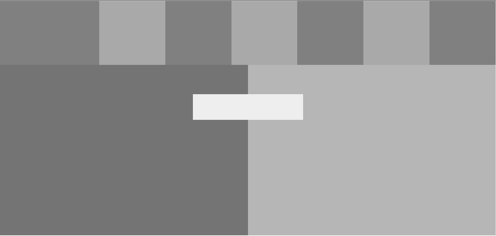

# Design-Teardown
This project consists of building a heatmap of the Smashing magazine website.

## Built With

- HTML and CSS,

## Live Demo

[Live Demo Link](https://adamclasic.github.io/Design-Teardown)

## Authors

👤 **Adam Allalou**
- Github: [@adamclasic](https://github.com/adamclasic)

👤 **Maurice Murangwa**

- Github: [@Morrism1](https://github.com/Morrism1)
- Twitter: [@MorrisMontana0](https://twitter.com/MorrisMontana0)
- Linkedin: [Maurice Murangwa](https://www.linkedin.com/in/murangwa-maurice-769549140/)

## 🤝 Contributing

Contributions, issues and feature requests are welcome!

Feel free to check the [issues page](issues/).

## Show your support

Give a ⭐️ if you like this project!

## 📝 License

This project is [MIT](lic.url) licensed.

